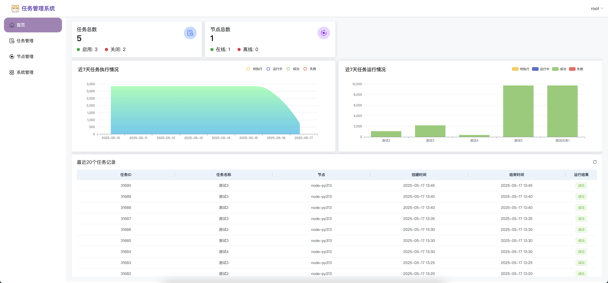
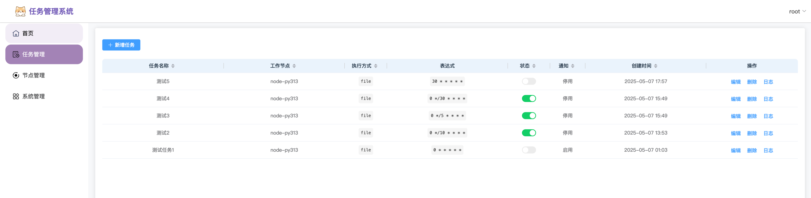
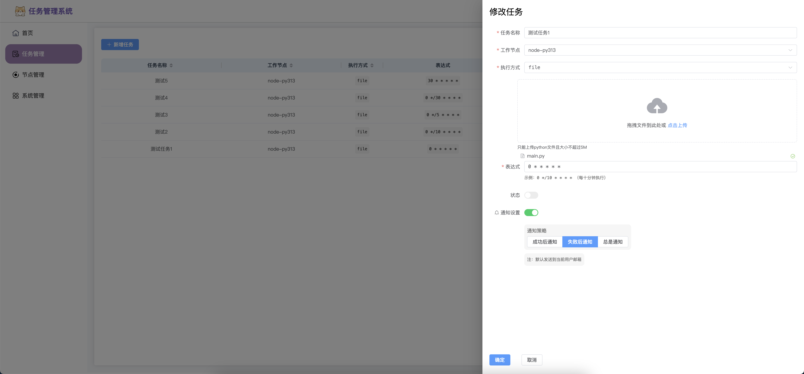
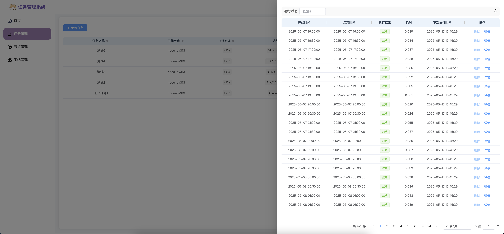
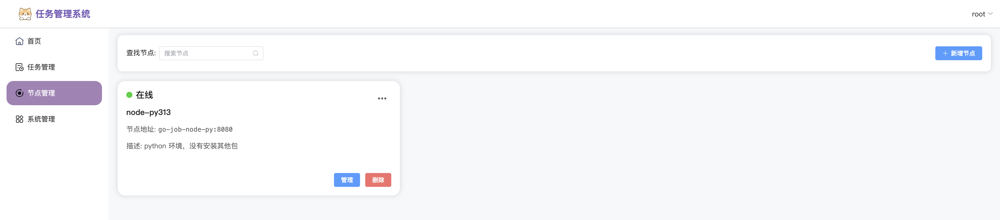
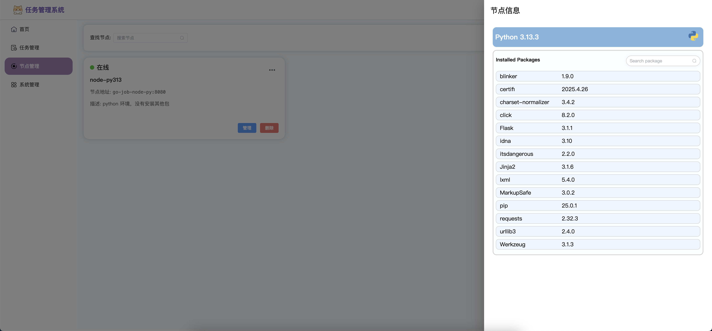
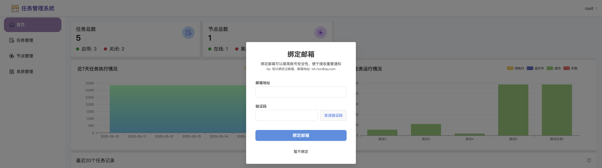

# V2 分支用于重构go-job-admin 

使用 Vite + Pinia + ElementUI 构建

## 页面展示

### 首页数据展示

### 任务管理

- 任务列表

    

- 任务编辑
    
    

- 任务运行记录

    
    

### 节点管理

- 节点列表

  

- 节点信息

    

### 用户管理

1. 绑定邮箱

